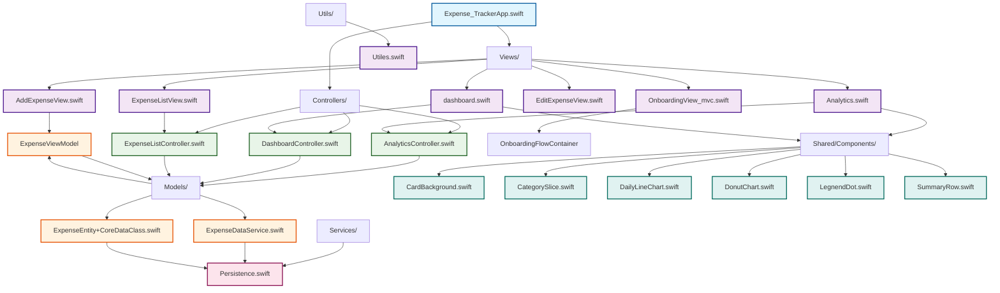

# Expense Tracker iOS App

A comprehensive iOS application for tracking personal expenses with modern SwiftUI architecture, built following MVC design patterns.

## 🛠 Tech Stack

### **Core Technologies**
- **Language**: Swift 5.9+
- **Framework**: SwiftUI
- **Platform**: iOS 15.0+
- **Architecture**: Model-View-Controller (MVC)

### **Data Management**
- **Database**: Core Data
- **Persistence**: NSPersistentContainer
- **State Management**: ObservableObject & @Published

### **UI/UX**
- **Design Framework**: SwiftUI
- **Charts**: Custom SwiftUI Charts
- **Icons**: SF Symbols
- **Color Scheme**: Custom gradients and themes

### **Development Tools**
- **IDE**: Xcode 15+
- **Version Control**: Git
- **Package Manager**: Swift Package Manager (SPM)
- **Testing**: XCTest (future implementation)

## 📱 Features

### **Core Functionality**
- ✅ **Expense Tracking**: Add, edit, and delete expenses
- ✅ **Categorization**: Organize expenses by categories (Food, Transport, Shopping, etc.)
- ✅ **Date-based Filtering**: View expenses by date ranges
- ✅ **Payment Methods**: Track different payment types (Cash, Card, etc.)
- ✅ **Notes**: Add optional notes to expenses

### **Analytics & Insights**
- 📊 **Spending Analytics**: Visual charts and graphs
- 📈 **Monthly Reports**: Detailed spending breakdowns
- 🎯 **Category Analysis**: Spending distribution by category
- 📅 **Daily Trends**: Daily spending patterns
- 💰 **Budget Tracking**: Monthly spending limits

### **User Experience**
- 🎨 **Modern UI**: Clean, intuitive SwiftUI interface
- 🌙 **Dark Mode**: Automatic dark/light mode support
- 📱 **Responsive Design**: Optimized for all iPhone sizes
- 🚀 **Smooth Navigation**: Tab-based navigation with onboarding
- 💾 **Data Persistence**: Local storage with Core Data

## 🏗 Architecture

This app follows the **Model-View-Controller (MVC)** architectural pattern for clean separation of concerns:

### **Model Layer**
- **ExpenseEntity**: Core Data entity for expense data
- **ExpenseViewModel**: Business logic for expense operations
- **ExpenseDataService**: Data access layer

### **View Layer**
- **SwiftUI Views**: Declarative UI components
- **Shared Components**: Reusable UI elements
- **Custom Charts**: Analytics visualizations

### **Controller Layer**
- **DashboardController**: Manages dashboard data and computations
- **AnalyticsController**: Handles analytics calculations and filtering
- **ExpenseListController**: Controls expense list operations

## 📂 Project Structure

```
Expense Tracker/
├── Controllers/
│   ├── AnalyticsController.swift      # Analytics business logic
│   ├── DashboardController.swift      # Dashboard data management
│   └── ExpenseListController.swift    # Expense list operations
├── Models/
│   ├── ExpenseDataService.swift       # Data access layer
│   ├── ExpenseEntity+CoreDataClass.swift # Core Data entity
│   └── ExpenseViewModel.swift         # Expense operations
├── Services/
│   └── Persistence.swift              # Core Data setup
├── Utils/
│   └── Utiles.swift                   # Utility functions
├── Views/
│   ├── AddExpenseView.swift           # Add new expense form
│   ├── Analytics.swift                # Analytics dashboard
│   ├── dashboard.swift                # Main dashboard
│   ├── EditExpenseView.swift          # Edit expense form
│   ├── ExpenseListView.swift          # Expense list with filters
│   └── OnboardingView_mvc.swift       # Onboarding flow
├── Shared/
│   └── Components/                    # Reusable UI components
│       ├── CardBackground.swift
│       ├── CategorySlice.swift
│       ├── DailyLineChart.swift
│       ├── DonutChart.swift
│       ├── LegnendDot.swift
│       └── SummaryRow.swift
├── Assets.xcassets/                   # App assets and images
├── Expense_Tracker.xcdatamodeld/      # Core Data model
└── Expense_TrackerApp.swift           # App entry point
```

## 🚀 Installation & Setup

### **Prerequisites**
- macOS 13.0+
- Xcode 15.0+
- iOS 15.0+ device/simulator

### **Steps**
1. **Clone the repository**
   ```bash
   git clone https://github.com/sulthann-nd/expensetracker_ios.git
   cd expensetracker_ios
   ```

2. **Open in Xcode**
   ```bash
   open "Expense Tracker.xcodeproj"
   ```

3. **Build and Run**
   - Select your target device/simulator
   - Press `Cmd + R` to build and run

### **First Launch**
- Complete the onboarding flow
- Set your financial goals
- Start adding expenses!

## 📖 Usage

### **Navigation**
- **Dashboard**: Overview of spending and quick actions
- **List**: Detailed expense list with filtering options
- **Analytics**: Visual insights and spending patterns

### **Adding Expenses**
1. Tap the "Add Expense" button on the dashboard
2. Fill in amount, category, date, and optional notes
3. Save to add to your expense history

### **Viewing Analytics**
- Switch to the Analytics tab
- Select different months using the date picker
- View spending by category and daily trends

## 🔗 File Connectivity



## 🤝 Contributing

We welcome contributions! Please follow these steps:

1. **Fork** the repository
2. **Create** a feature branch (`git checkout -b feature/amazing-feature`)
3. **Commit** your changes (`git commit -m 'Add amazing feature'`)
4. **Push** to the branch (`git push origin feature/amazing-feature`)
5. **Open** a Pull Request

### **Code Style**
- Follow Swift API Design Guidelines
- Use meaningful variable and function names
- Add documentation for public APIs
- Keep functions focused on single responsibilities

## 👨‍💻 Author

**Sulthan Navadeep**
- GitHub: [@sulthann-nd](https://github.com/sulthann-nd)

## 🙏 Acknowledgments

- Apple for SwiftUI and Core Data frameworks
- SwiftUI community for inspiration and best practices
- Open source contributors for various Swift packages

---

**Happy Expense Tracking!** 💰📊
