# Expense Tracker iOS App

A comprehensive iOS application for tracking personal expenses with modern SwiftUI architecture, built following MVC design patterns.

## 🛠 Tech Stack

### **Core Technologies**
- **Language**: Swift 5.9+
- **Framework**: SwiftUI
- **Platform**: iOS 15.0+
- **Architecture**: Model-View-Controller (MVC)

### **Data Management**
- **Database**: Core Data
- **Persistence**: NSPersistentContainer
- **State Management**: ObservableObject & @Published

### **UI/UX**
- **Design Framework**: SwiftUI
- **Charts**: Custom SwiftUI Charts
- **Icons**: SF Symbols
- **Color Scheme**: Custom gradients and themes

### **Development Tools**
- **IDE**: Xcode 15+
- **Version Control**: Git
- **Package Manager**: Swift Package Manager (SPM)
- **Testing**: XCTest (future implementation)

## 📱 Features

### **Core Functionality**
- ✅ **Expense Tracking**: Add, edit, and delete expenses
- ✅ **Categorization**: Organize expenses by categories (Food, Transport, Shopping, etc.)
- ✅ **Date-based Filtering**: View expenses by date ranges
- ✅ **Payment Methods**: Track different payment types (Cash, Card, etc.)
- ✅ **Notes**: Add optional notes to expenses

### **Analytics & Insights**
- 📊 **Spending Analytics**: Visual charts and graphs
- 📈 **Monthly Reports**: Detailed spending breakdowns
- 🎯 **Category Analysis**: Spending distribution by category
- 📅 **Daily Trends**: Daily spending patterns
- 💰 **Budget Tracking**: Monthly spending limits

### **Exchange Rate Tools** 🌍💱
- 💱 **Currency Converter** - Real-time currency conversion using local calculation with cached rates
- 📊 **Latest Exchange Rates** - Current rates for all currencies (EUR base)
- 📈 **Historical Rates** - Exchange rates for specific dates with filtering
- 🏷️ **Currency Symbols** - Complete list of currency codes and names
- 📅 **Date Picker Integration** - Calendar-based date selection for historical data
- 🔄 **Real-time API** - Live data from ExchangeRate-API (free tier)
- ⚡ **Smart Data Loading** - Optimized loading with caching and on-demand fetching

## 🏗 Architecture

This app follows the **Model-View-Controller (MVC)** architectural pattern for clean separation of concerns:

### **Model Layer**
- **ExpenseEntity**: Core Data entity for expense data
- **ExpenseViewModel**: Business logic for expense operations
- **ExpenseDataService**: Data access layer

### **View Layer**
- **SwiftUI Views**: Declarative UI components
- **Shared Components**: Reusable UI elements
- **Custom Charts**: Analytics visualizations

### **Controller Layer**
- **DashboardController**: Manages dashboard data and computations
- **AnalyticsController**: Handles analytics calculations and filtering
- **ExpenseListController**: Controls expense list operations

## 🔗 API Integration

**ExchangeRate-API (Free Tier)**
- **Base URL**: `http://api.exchangeratesapi.io/v1/` (HTTP with ATS exception)
- **Features**: Latest rates, currency symbols, historical rates
- **Conversion**: Local calculation using cached rates (free tier doesn't support convert endpoint)
- **Limitations**: EUR base only, requires API key, free tier restrictions
- **Network**: URLSession with Combine for reactive networking
- **Security**: App Transport Security exception configured via Xcode build settings

## 📦 Dependencies

**Core iOS Frameworks:**
- `SwiftUI` - Declarative UI framework
- `CoreData` - Local data persistence
- `Combine` - Reactive programming framework
- `Foundation` - Core iOS functionality

**Networking:**
- `URLSession` - HTTP networking
- `Combine` - Reactive network requests
- `JSONDecoder` - JSON parsing

## 📂 Project Structure

```
Expense Tracker/
├── Controllers/
│   ├── AnalyticsController.swift      # Analytics business logic
│   ├── DashboardController.swift      # Dashboard data management
│   └── ExpenseListController.swift    # Expense list operations
├── Models/
│   ├── ExchangeRateModels.swift       # Exchange rate data models
│   ├── ExchangeRateViewModel.swift    # Exchange rate business logic
│   ├── ExpenseDataService.swift       # Data access layer
│   ├── ExpenseEntity+CoreDataClass.swift # Core Data entity
│   └── ExpenseViewModel.swift         # Expense operations
├── Services/
│   ├── ExchangeRateService.swift      # Exchange rate API service
│   └── Persistence.swift              # Core Data setup
├── Utils/
│   └── Utiles.swift                   # Utility functions
├── Views/
│   ├── AddExpenseView.swift           # Add new expense form
│   ├── Analytics.swift                # Analytics dashboard
│   ├── dashboard.swift                # Main dashboard
│   ├── EditExpenseView.swift          # Edit expense form
│   ├── ExchangeRateView.swift         # Exchange rate tools
│   ├── ExpenseListView.swift          # Expense list with filters
│   └── OnboardingView_mvc.swift       # Onboarding flow
├── Shared/
│   └── Components/                    # Reusable UI components
│       ├── CardBackground.swift
│       ├── CategorySlice.swift
│       ├── DailyLineChart.swift
│       ├── DonutChart.swift
│       ├── LegnendDot.swift
│       └── SummaryRow.swift
├── Assets.xcassets/                   # App assets and images
├── Expense_Tracker.xcdatamodeld/      # Core Data model
└── Expense_TrackerApp.swift           # App entry point
```

## 🚀 Installation & Setup

### **Prerequisites**
- macOS 13.0+
- Xcode 15.0+
- iOS 15.0+ device/simulator

### **Steps**
1. **Clone the repository**
   ```bash
   git clone https://github.com/sulthann-nd/expensetracker_ios.git
   cd expensetracker_ios
   ```

2. **Open in Xcode**
   ```bash
   open "Expense Tracker.xcodeproj"
   ```

3. **Build and Run**
   - Select your target device/simulator
   - Press `Cmd + R` to build and run

### **First Launch**
- Complete the onboarding flow
- Set your financial goals
- Start adding expenses!

## 📖 Usage

### **Navigation**
- **Dashboard**: Overview of spending and quick actions
- **List**: Detailed expense list with filtering options
- **Analytics**: Visual insights and spending patterns

### **Adding Expenses**
1. Tap the "Add Expense" button on the dashboard
2. Fill in amount, category, date, and optional notes
3. Save to add to your expense history

### **Viewing Analytics**
- Switch to the Analytics tab
- Select different months using the date picker
- View spending by category and daily trends

### **Exchange Rate Tools** 🌍💱

#### **Currency Converter**
- Navigate to the Exchange tab
- Select currencies from the dropdown menus for "From" and "To"
- Enter the amount to convert
- Tap "Convert" to get conversion using cached latest rates (local calculation)

#### **Latest Exchange Rates**
- View current rates for all currencies (EUR base)
- Use the search bar to filter specific currencies
- Real-time data fetched from ExchangeRate-API

#### **Historical Rates**
- Select a date using the date picker
- Choose a currency from the dropdown menu
- Tap "Fetch Historical Rates" to load past rates
- Use search to filter the results

#### **Performance Features**
- **Smart Loading**: Currency symbols and latest rates load once when opening the tab
- **Automatic Updates**: Historical rates refresh automatically when date changes
- **Manual Refresh**: Use the refresh button in the top-right to update all data
- **Efficient Caching**: Data is cached to avoid unnecessary API calls

## 🔗 File Connectivity

```mermaid
graph TD
    %% Main App Entry Point
    A[Expense_TrackerApp.swift] --> B[Views/]
    A --> C[Controllers/]
    
    %% Views Folder
    B --> D[AddExpenseView.swift]
    B --> E[Analytics.swift]
    B --> F[dashboard.swift]
    B --> G[EditExpenseView.swift]
    B --> H[ExchangeRateView.swift]
    B --> I[ExpenseListView.swift]
    B --> J[OnboardingView_mvc.swift]
    
    %% Controllers Folder
    C --> K[AnalyticsController.swift]
    C --> L[DashboardController.swift]
    C --> M[ExpenseListController.swift]
    
    %% Models Folder
    N[Models/] --> O[ExchangeRateModels.swift]
    N --> P[ExchangeRateViewModel.swift]
    N --> Q[ExpenseDataService.swift]
    N --> R[ExpenseEntity+CoreDataClass.swift]
    N --> S[ExpenseViewModel.swift]
    
    %% Services Folder
    T[Services/] --> U[ExchangeRateService.swift]
    T --> V[Persistence.swift]
    D --> M[ExpenseViewModel]
    E --> J
    F --> K
    H --> L
    I --> N[OnboardingFlowContainer]
    
    %% Controllers to Models/Services
    J --> O[Models/]
    K --> O
    L --> O
    M --> O
    
    %% Models Folder
    O --> P[ExpenseDataService.swift]
    O --> Q[ExpenseEntity+CoreDataClass.swift]
    O --> M
    
    %% Services Folder
    R[Services/] --> S[Persistence.swift]
    
    %% Models to Services
    P --> S
    Q --> S
    
    %% Utils Folder
    T[Utils/] --> U[Utiles.swift]
    
    %% Shared Components
    V[Shared/Components/] --> W[CardBackground.swift]
    V --> X[CategorySlice.swift]
    V --> Y[DailyLineChart.swift]
    V --> Z[DonutChart.swift]
    V --> AA[LegnendDot.swift]
    V --> BB[SummaryRow.swift]
    
    %% Views use Shared Components
    E --> V
    F --> V
    
    %% Styling
    classDef app fill:#e1f5fe,stroke:#01579b,stroke-width:2px
    classDef view fill:#f3e5f5,stroke:#4a148c,stroke-width:2px
    classDef controller fill:#e8f5e8,stroke:#1b5e20,stroke-width:2px
    classDef model fill:#fff3e0,stroke:#e65100,stroke-width:2px
    classDef service fill:#fce4ec,stroke:#880e4f,stroke-width:2px
    classDef util fill:#f3e5f5,stroke:#4a148c,stroke-width:2px
    classDef shared fill:#e0f2f1,stroke:#00695c,stroke-width:2px
    
    class A app
    class D,E,F,G,H,I view
    class J,K,L controller
    class P,Q,M model
    class S service
    class U util
    class W,X,Y,Z,AA,BB shared
```



## 🚀 Getting Started

### **Prerequisites**
- **Xcode**: 15.0 or later
- **iOS**: 15.0+ deployment target
- **macOS**: 12.0 or later

### **Setup Instructions**

1. **Clone the Repository**
   ```bash
   git clone <repository-url>
   cd "Expense Tracker"
   ```

2. **Open in Xcode**
   ```bash
   open "Expense Tracker.xcodeproj"
   ```

3. **API Key Setup**
   - Sign up for a free API key at [ExchangeRate-API](https://exchangeratesapi.io/)
   - Open `Services/ExchangeRateService.swift`
   - Replace `YOUR_API_KEY_HERE` with your actual API key:
   ```swift
   private let accessKey = "your_actual_api_key_here"
   ```

4. **App Transport Security Configuration (Required for API)**
   - Open your project in Xcode
   - Select the project file in the Project Navigator
   - Select your target under "Targets"
   - Go to the "Info" tab
   - Under "Custom iOS Target Properties", click the "+" button
   - Add the following keys:
   
   **Key**: `NSAppTransportSecurity`
   **Type**: `Dictionary`
   
   **Sub-key**: `NSExceptionDomains`
   **Type**: `Dictionary`
   
   **Sub-sub-key**: `api.exchangeratesapi.io`
   **Type**: `Dictionary`
   
   **Sub-sub-sub-keys**:
   - `NSExceptionAllowsInsecureHTTPLoads` → `YES` (Boolean)
   - `NSExceptionMinimumTLSVersion` → `TLSv1.0` (String)
   - `NSExceptionRequiresForwardSecrecy` → `NO` (Boolean)
   - `NSIncludesSubdomains` → `YES` (Boolean)

4. **Build and Run**
   - Select your target device/simulator
   - Press `Cmd + R` to build and run

### **First Launch**
- Complete the onboarding flow
- Set your financial goals
- Start adding expenses!
- Use the Exchange tab for currency tools

## 🤝 Contributing

We welcome contributions! Please follow these steps:

1. **Fork** the repository
2. **Create** a feature branch (`git checkout -b feature/amazing-feature`)
3. **Commit** your changes (`git commit -m 'Add amazing feature'`)
4. **Push** to the branch (`git push origin feature/amazing-feature`)
5. **Open** a Pull Request

### **Code Style**
- Follow Swift API Design Guidelines
- Use meaningful variable and function names
- Add documentation for public APIs
- Keep functions focused on single responsibilities

## 👨‍💻 Author

**Sulthan Navadeep**
- GitHub: [@sulthann-nd](https://github.com/sulthann-nd)

## 🙏 Acknowledgments

- Apple for SwiftUI and Core Data frameworks
- SwiftUI community for inspiration and best practices
- Open source contributors for various Swift packages

---

**Happy Expense Tracking!** 💰📊
